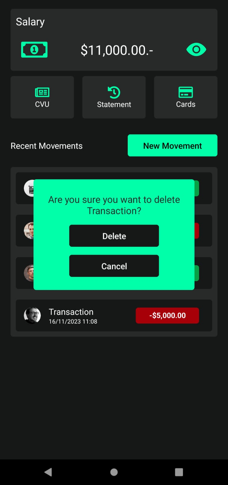

# Bank-Z 🏛

## Description

Welcome to Bank-Z, a simple banking management system developed in React Native that allows you to perform basic banking operations. Bank-Z uses Firebase as a backend to store movements information

## Features

- **Banking Operations:** Perform operations such as deposits and withdrawals.
- **Account Details:** Share your account number or CVU by copying it on the clipboard !
- **Balance Inquiry:** Check your account balance at any time.

## ScreenShots

<div style="display: flex; justify-content: space-around;">
  
  
  
  
</div>


## Prerequisites

Make sure to have Node.js, Android Studio and npm installed before running the application.

## Instalación
```bash
git clone https://github.com/ManukBASS/Bank-Z.git
cd Bank-Z
npm install
npm start
a (on the Expo menu, allowing connection between the app with your virtual device)
